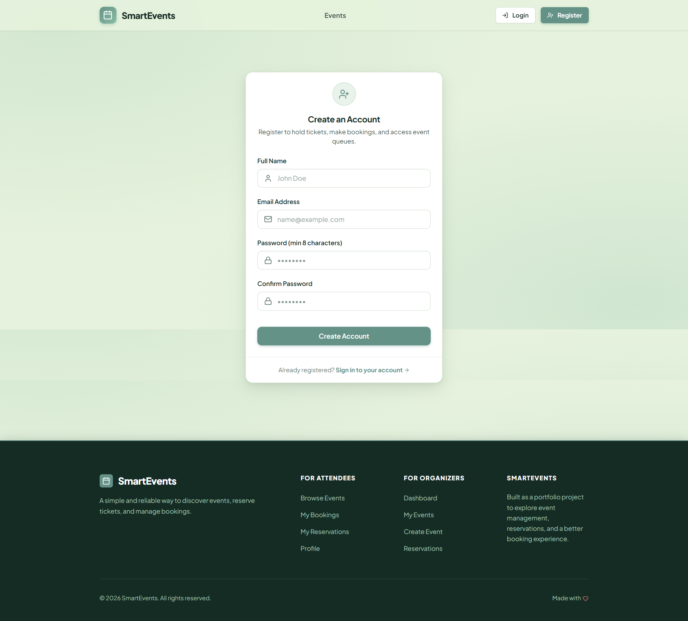
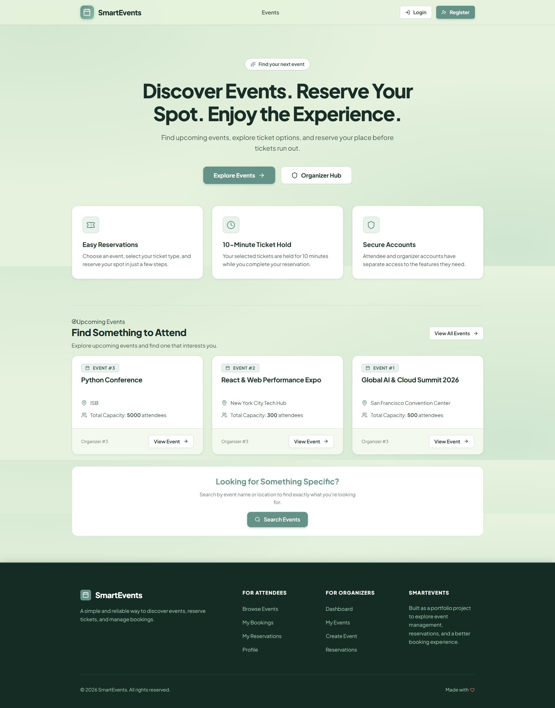
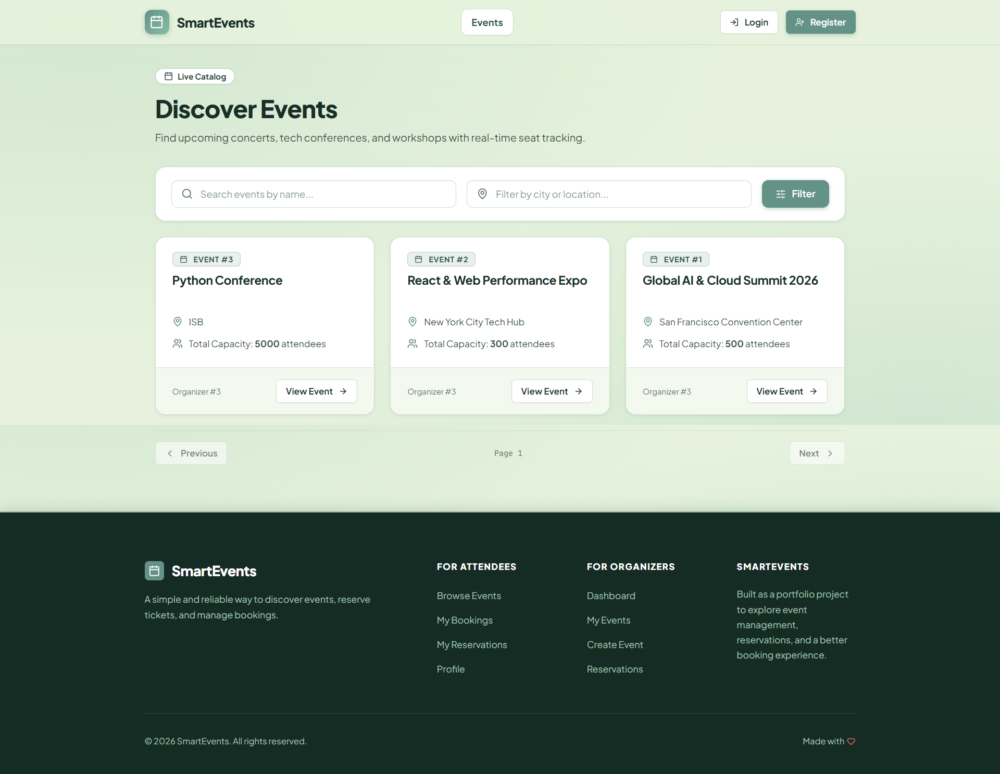
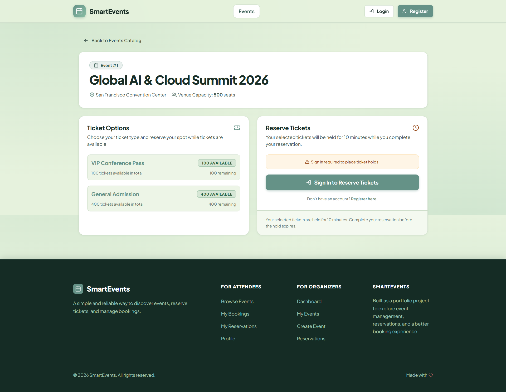
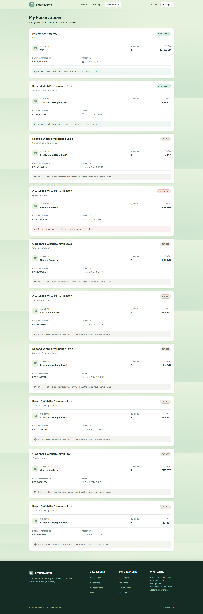
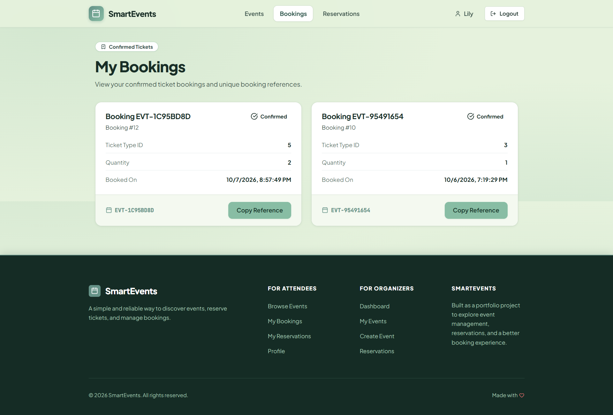
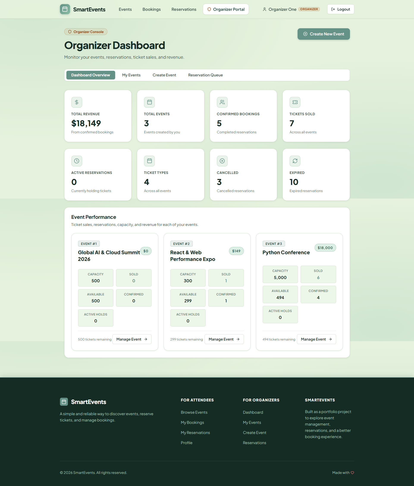

# Smart Event Reservation & Queue System

A full-stack event reservation system built with **FastAPI, PostgreSQL, React, and TypeScript**.

I built this project to practice backend development and work with real-world problems such as authentication, ticket availability, reservations, and handling multiple users trying to reserve tickets at the same time.

---

## Screenshots

### Register Page



### Home Page



### Events



### Event Details & Ticket Reservation



### Reservations



### Bookings



### Organizer Dashboard



---

## What the Project Does

### For Attendees

* Create an account and log in
* Browse and search events
* View ticket availability
* Select ticket types and quantities
* Temporarily hold tickets
* Confirm or cancel reservations
* Reservations automatically expire after 10 minutes
* View reservation history and confirmed bookings

### For Organizers

* Create and edit events
* Create and manage ticket types
* Set ticket prices and quantities
* View reservations
* Monitor event statistics
* Track ticket sales and revenue

---

## A Few Technical Highlights

### Preventing Ticket Overselling

One of the main things I focused on was making sure two users cannot reserve the same tickets at the same time.

The backend uses **database row locking** when checking ticket availability. This allows the reservation process to safely handle concurrent requests.

### Temporary Ticket Holds

When a user reserves tickets, they are held for **10 minutes**.

If the reservation is confirmed, the booking remains confirmed.

If the user cancels it or the hold expires, the tickets become available again.

### Authentication & Authorization

The application has separate attendee and organizer roles.

Organizer routes are protected so regular users cannot access organizer functionality.

---

## Tech Stack

**Backend**

* Python
* FastAPI
* SQLAlchemy
* PostgreSQL
* Alembic
* Pydantic
* APScheduler
* pytest

**Frontend**

* React
* TypeScript
* Vite
* React Router
* Lucide React
* CSS

---

## Project Structure

```text
event-reservation-system/
│
├── app/                  # FastAPI backend
├── alembic/              # Database migrations
├── tests/                # Backend tests
├── frontend/             # React frontend
├── requirements.txt
├── alembic.ini
|__ pytest.ini
└── README.md
```

---

## Running Locally

### Backend

Create and activate a virtual environment:

```bash
python -m venv .venv
```

Windows:

```powershell
.venv\Scripts\Activate.ps1
```

Install dependencies:

```bash
pip install -r requirements.txt
```

Create a `.env` file using `.env.example` and configure your PostgreSQL database.

Run migrations:

```bash
alembic upgrade head
```

Start the API:

```bash
fastapi dev app/main.py
```

API documentation will be available at:

```text
http://127.0.0.1:8000/docs
```

### Frontend

```bash
cd frontend
npm install
npm run dev
```

---

## Testing

Backend tests:

```bash
pytest
```

Frontend lint:

```bash
cd frontend
npm run lint
```

Frontend production build:

```bash
npm run build
```

---

## What I Learned

Through this project I got practical experience with:

* Building REST APIs with FastAPI
* Working with PostgreSQL and SQLAlchemy
* Database migrations with Alembic
* Authentication and role-based access
* Handling reservations and ticket availability
* Database transactions and row locking
* Background scheduled tasks
* Connecting a React frontend to a backend API
* Testing backend functionality with pytest
* Using Git and GitHub for project development

---

## Future Improvements

Some things I may add later:

* Online payments
* Email booking confirmations
* QR-code tickets
* Better analytics
* CI/CD
* Deployment and monitoring

---

## Project Status

**Completed**

This project was built as a portfolio project to gain practical experience in backend and full-stack development.

---

## Author

**Khadija Qasim**

[GitHub](https://github.com/kq-050/) · [LinkedIn](https://www.linkedin.com/in/khadija-qasim-986789327/)
